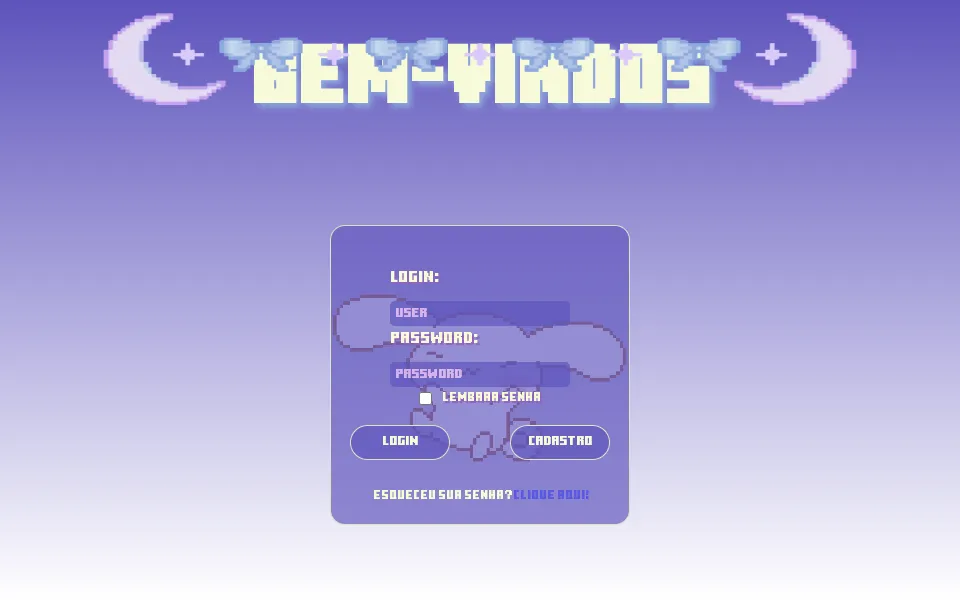

<h1 align="center">
    Login page - ReactJs
</h1>

<h4 align="center"><a href="https://login-reactjs.netlify.app/">Clique para acessar o projeto</a></h4>

   Sejam bem-vindos ao meu projeto! Este projeto foi desenvolvido utilizando React e Sass, e inclui uma página de login e de criação de usuários.

Tecnologias utilizadas:

Para o desenvolvimento deste site utilizei as seguintes tecnologias:

- ReactJs;
- Sass;
---
